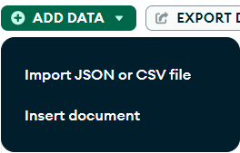
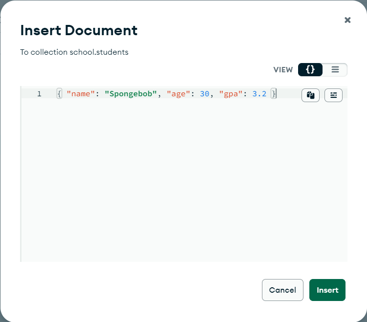

# [Youtube] Learn MongoDB in 1 Hour 🍃 (2023)(1) - Bro Code

---

### MongoDB 란?

- 방대한(Humongous) 양의 데이터를 관리할 수 있는 NoSQL DBMS
- 많은 빅테크 기업에서 실제로 사용하며 사용 추세가 증가 중임
- ‘NoSQL’은 ‘Not Only SQL’의 약칭.
    
    전통적인 테이블의 Row와 Column에 맞춰 데이터가 저장되는 방식과 다르게, 데이터가 다양한 포맷으로 저장될 수 있음.
    
- 하나의 데이터를 Document 로 저장함. 즉, 전통적인 테이블 방식에서 하나의 행인 인스턴스가 MongoDB에서는 Document.
    
    ```jsx
    {
    	name: 'Spongebob',
    	age: 30,
    	gpa: 3.2,
    	fullTime: false,
    }
    ```
    
    각 Document의 데이터들은 Field-Value 쌍으로 저장됨.
    
    JSON 포맷과 비슷한 형태이지만, BSON이라는 포맷을 사용함.
    
    그러나 JSON과 매우 유사하게 사용됨
    
- Document로 저장하는 아이디어는, 동시에 자주 접근되는 데이터들은 테이블을 나누지 말고 함께 저장하자는 것임. 여러 테이블에 분할되어 저장되면 귀찮은 조인 연산을 계속해서 수행해야 하기 때문.
- Collection은 하나 이상의 Document들의 집합이며, 데이터베이스는 Collection들의 집합이다.

### MongoDB 설치

- [mongodb.com](http://mongodb.com) 에서 리소스 > 서버 > Installation 에서 다운로드 센터로 이동하여 설치하고, 설치 파일 실행하면 MongoDB Compass 도 같이 설치할 수 있음.
- 추가로 Installation 에서 MongoDB Shell (mongosh)도 같이 설치. 압축파일 다운로드한 뒤 압축 풀고 경로를 시스템 환경 변수에 등록.
- VS Code 에서 MongoDB 익스텐션 설치한 뒤, 연결된 서버에 오른쪽 마우스 클릭해서 ‘Launch MongoDB Shell’ 클릭하면 VS Code 내에서 mongosh 실행할 수 있음.

### DB 생성과 삭제

**mongosh**

- cmd 또는 PowerShell 에서 **`mongosh`** 를 입력하면, MongoDB Shell 이 실행됨.
- **`cls`**: 화면 정리
- **`show dbs`**: 현재 서버의 모든 데이터베이스의 리스트를 보여줌.
- **`use db명`**: 존재하는 DB를 사용하거나 존재하지 않으면 생성. 새로 생성된 DB는 show dbs 해도 비어있기 때문에 보이지 않음.
- **`db.createCollections(”컬렉션 이름”)`**: DB 내에 컬렉션을 생성. 성공하면 **`{ ok: 1 }`** 을 반환함.
- **`db.dropDatabase()`**: DB 를 드랍(제거).

**MongoDB Compass**

- 간단하게 Create database 버튼으로 DB 명과 컬렉션명을 입력하면 DB 를 생성할 수 있음.
- 왼쪽 사이드 바에서 간단하게 드랍도 가능함.

### DB 에 Document 삽입

**mongosh**

- **`db.컬렉션명.insertOne({Field:Value})`**: 컬렉션에 Document 를 하나 삽입함. 만약 컬렉션이 존재하지 않으면 하나 생성함.
    
    ```powershell
    school> db.students.insertOne({name:"Spongebob", age:30, gpa:3.2})
    {
      acknowledged: true,
      insertedId: ObjectId('664332016436abff0d46b799')
    }
    ```
    
- **`db.컬렉션명.find()`**: 컬렉션 내에 존재하는 모든 Document 를 반환.
    
    ```powershell
    school> db.students.find()
    [
      {
        _id: ObjectId('664332016436abff0d46b799'),
        name: 'Spongebob',
        age: 30,
        gpa: 3.2
      }
    ]
    ```
    
- **`db.컬렉션명.insertMany([{Field:Value, Field:Value, …}, {Field:Value, Field:Value, …}, ... ])`**: 컬렉션에 여러 개의 Document 를 삽입함. ~~언어마다 다르지만,~~ 배열 기호 내부에 { } 들이 모두 Document 들이고, 이 Document 들이 컬렉션에 삽입됨. Field:Value 쌍은 항상 일관적일 필요는 없음. 즉, 모든 Document 가 일관된 Field 값들을 정해서 삽입할 필요가 없음.
    
    ```powershell
    school> db.students.insertMany([{name:"Patrick", age:38, gpa:1.5}, {name:"Sandy", age:27, gpa:4.0}, {name:"Gary", age:18, gpa:2.5}])
    {
      acknowledged: true,
      insertedIds: {
        '0': ObjectId('664340a06436abff0d46b79a'),
        '1': ObjectId('664340a06436abff0d46b79b'),
        '2': ObjectId('664340a06436abff0d46b79c')
      }
    }
    ```
    
    ```powershell
    school> db.students.find()
    [
      {
        _id: ObjectId('664332016436abff0d46b799'),
        name: 'Spongebob',
        age: 30,
        gpa: 3.2
      },
      {
        _id: ObjectId('664340a06436abff0d46b79a'),
        name: 'Patrick',
        age: 38,
        gpa: 1.5
      },
      {
        _id: ObjectId('664340a06436abff0d46b79b'),
        name: 'Sandy',
        age: 27,
        gpa: 4
      },
      {
        _id: ObjectId('664340a06436abff0d46b79c'),
        name: 'Gary',
        age: 18,
        gpa: 2.5
      }
    ]
    ```
    

**MongoDB Compass**

- 다음과 같은 과정을 통해 삽입됨.
    1. Insert document 클릭
    
    <p align="center">
     
    </p>
    
    2. 쉘에서 입력했던 것처럼 Document 입력
    
    <p align="center">
     
    </p>
    
    3. 우측의 포맷화 버튼 클릭하여 포맷화한 후 삽입
    
    <p align="center">
     
    </p>
    
    4. 여러 Document 를 입력하고 싶으면 쉘에서 입력했던 것처럼 입력 후, 포맷화하고 삽입
    
    <p align="center">
     
    </p>
    

### MongoDB 의 기본 데이터 타입

- String: 이름처럼 연속된 문자열
    - 사용 예시: **`{name:”Larry Lobster123”}`**
    - “ ” 또는 ‘ ’ 안에 문자열을 명시해줘야 함
    - 공백을 쓸 수 있고 숫자도 넣을 수 있음
- Integer
    - 사용 예시: **`{age: 32}`**
- Double
    - 사용 예시: **`{gpa: 2.8}`**
- Boolean
    - 사용 예시: **`{fullTime: false}`**
    - false 또는 true 만 Value 로 들어갈 수 있음
- Date 객체
    - 사용 예시: **`{regeisterDate: new Date(”2023-01-02T00:00:00”)}`**
    - 아무런 매개변수를 넘겨주지 않으면 UTC 의 현재 시간을 저장
- Null
    - 사용 예시: **`{graduationDate: null}`**
    - null 은 no value, 필드에 대한 값을 현재 모르거나 존재하지 않을 때 사용
    - 필드의 자리를 지키는 Placeholder 용으로 쓰임
- Field
    - 사용 예시: **`{courses: [”Biology”, “Chemistry”, “Calculus”]}`**
    - 현대의 프로그래밍 언어의 변수들은 대부분 하나 이상의 값을 가짐
    - MongoDB 에서는 필드가 Field 라는 데이터 타입으로 하나 이상의 값을 가질 수 있음
    - [ ] 대괄호 안에 배열처럼 하나씩 값을 넣어줌
- Nested documents
    - 사용 예시: **`{address: {street:”123 Fake St.”, city:”Bikini Bottom”, zip:12345}}`**
    - 주소를 표현하기에 좋음
    - 여러 변수에 대응하는 값을 집어넣을 수 있음
- 실제로 mongosh 를 통해 입력하면, 다음과 같이 등록되고,
    
    ```powershell
    school> db.students.insertOne({name:"Larry Lobster123",
    ... age:32,
    ... gpa:2.8,
    ... fullTime:false,
    ... registerDate: new Date(),
    ... graduationDate: null,
    ... courses: ["Biology", "Chemistry", "Calculus"],
    ... address: {street:"123 Fake St.",
    ... city:"Bikini Bottom",
    ... zip:12345}})
    {
      acknowledged: true,
      insertedId: ObjectId('66434835a4645d567946b79a')
    }
    ```
    
    MongoDB Compass 를 들어가서 확인하면 이렇게 업데이트 되어있음.
    
    <p align="center">
     
    </p>
