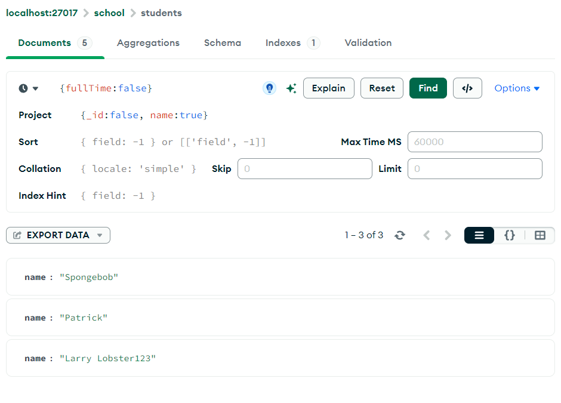
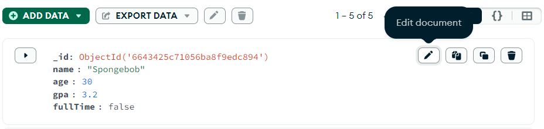
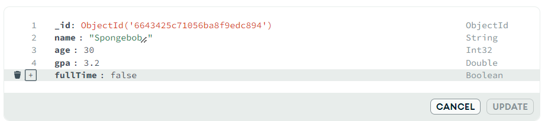
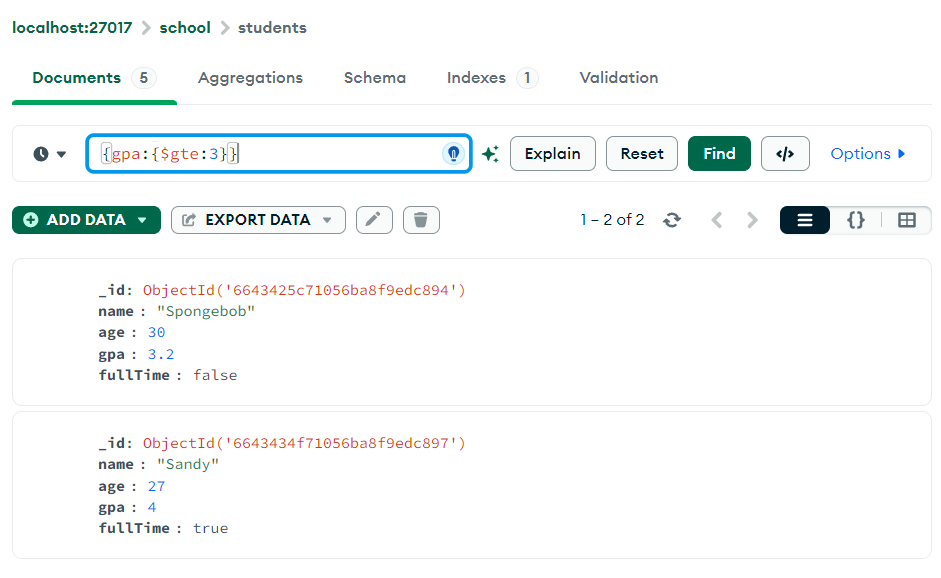

# [Youtube] Learn MongoDB in 1 Hour 🍃 (2023)(2) - Bro Code

---

### Sorting and Limiting (정렬과 제한)

Documents 볼 때 정렬해서 보거나, 개수를 제한하여 보는 방법.

**mongosh: Sorting**

- **`db.컬렉션명.find().sort({필드:정렬기준})`**
    
    **`db.컬렉션명.find()`** 에 추가로 **`sort()`** 메소드를 호출한다.
    
    **`find()`** 로 반환될 Documents 들을 정렬해서 볼 수 있음.
    
    **`sort()`** 메소드는 매개변수로 중괄호 안에 필드와 정렬기준을 받음.
    
- 정렬 기준에 대하여
    - 1 : 알파벳순, 또는 오름차순
    - -1 : 알파벳 역순, 또는 내림차순
- 사용 예시
    - **`db.students.find().sort({name:1})`**: name 필드를 알파벳 순으로 정렬하여 students 컬렉션의 Documents 들을 반환
        
        ```powershell
        school> db.students.find().sort({name:1})
        [
          {
            _id: ObjectId('6643434f71056ba8f9edc898'),
            name: 'Gary',
            age: null,
            gpa: 2.5,
            fullTime: true
          },
          {
            _id: ObjectId('66434835a4645d567946b79a'),
            name: 'Larry Lobster123',
            age: 32,
            gpa: 2.8,
            fullTime: false,
            registerDate: ISODate('2024-05-14T11:17:09.122Z'),
            graduationDate: null,
            courses: [ 'Biology', 'Chemistry', 'Calculus' ],
            address: { street: '123 Fake St.', city: 'Bikini Bottom', zip: 12345 }
          },
          {
            _id: ObjectId('6643434f71056ba8f9edc896'),
            name: 'Patrick',
            age: 38,
            gpa: 1.5,
            fullTime: false
          },
          {
            _id: ObjectId('6643434f71056ba8f9edc897'),
            name: 'Sandy',
            age: 27,
            gpa: 4,
            fullTime: true
          },
          {
            _id: ObjectId('6643425c71056ba8f9edc894'),
            name: 'Spongebob',
            age: 30,
            gpa: 3.2,
            fullTime: false
          }
        ]
        ```
        
    - **`db.students.find().sort({name:-1})`**: name 필드를 알파벳 역순으로 정렬하여 반환
    - **`db.students.find().sort({gpa:1})`**: gpa 필드를 오름차순으로 정렬하여 반환
        
        ```powershell
        school> db.students.find().sort({gpa:1})
        [  
          {
            _id: ObjectId('6643434f71056ba8f9edc896'),
            name: 'Patrick',
            age: 38,
            gpa: 1.5,
            fullTime: false
          },
          {
            _id: ObjectId('6643434f71056ba8f9edc898'),
            name: 'Gary',
            age: null,
            gpa: 2.5,
            fullTime: true
          },
          {
            _id: ObjectId('66434835a4645d567946b79a'),
            name: 'Larry Lobster123',
            age: 32,
            gpa: 2.8,
            fullTime: false,
            registerDate: ISODate('2024-05-14T11:17:09.122Z'),
            graduationDate: null,
            courses: [ 'Biology', 'Chemistry', 'Calculus' ],
            address: { street: '123 Fake St.', city: 'Bikini Bottom', zip: 12345 }
          },
          {
            _id: ObjectId('6643425c71056ba8f9edc894'),
            name: 'Spongebob',
            age: 30,
            gpa: 3.2,
            fullTime: false
          },
          {
            _id: ObjectId('6643434f71056ba8f9edc897'),
            name: 'Sandy',
            age: 27,
            gpa: 4,
            fullTime: true
          }
        ]
        ```
        
    - **`db.students.find().sort({gpa:-1})`**: gpa 필드를 내림차순으로 정렬하여 반환

**mongosh: Limiting**

- **`db.컬렉션명.find().limit(숫자)`**
    
    **`db.컬렉션명.find()`** 에 **`limit()`** 메소드를 호출한다.
    
    **`limit()`** 은 매개변수로 불러올 Documents 개수를 받음.
    
    예를 들어, **`limit(1)`** 과 같이 설정하면 1개의 Document 만 반환
    
- 사용 예시
    - **`db.students.find().limit(1)`**: Document 1개만 불러온다. 일반적으로 Documents 들은 컬렉션 내에서 id 로 정렬되어 있고, 가장 상위 id 를 가진 Document 가 보여지게 된다.
        
        ```powershell
        school> db.students.find().limit(1)
        [  
          {
            _id: ObjectId('6643425c71056ba8f9edc894'),
            name: 'Spongebob',
            age: 30,
            gpa: 3.2,
            fullTime: false
          }
        ]
        ```
        

**mogosh: Sorting and Limiting**

- 사용 예시
    - **`db.students.find().sort({gpa:-1}).limit(1)`**: 가장 높은 gpa 값을 가진 Document 하나만 불러온다.
        
        ```powershell
        school> db.students.find().sort({gpa:-1}).limit(1)
        [  
          {
            _id: ObjectId('6643434f71056ba8f9edc897'),
            name: 'Sandy',
            age: 27,
            gpa: 4,
            fullTime: true
          }
        ]
        ```
        

**MongoDB Compass**

- 쿼리 시에 추가 옵션으로 Sort 와 Limit 을 줄 수 있다.
    
    Sort 는 쉘과 같이 입력하고, Limit 은 숫자만 써주면 된다.
    
    <p align="center">
     
    </p>
    

### Find (검색)

Documents 를 조회할 때 특정한 Documents 만 선택해서 불러오거나, 원하는 필드 값만 보도록 지정할 수 있다.

**mongosh**

- **`db.컬렉션명.find({query}, {projection})`**
    
    **`find()`** 는 두 개의 매개변수를 받는다. (하나만 입력해도 된다)
    
    ```powershell
    [ 사용 예시 ]
    school> db.students.find({fullTime:false}, {_id:false, name:true})
    [ { name: 'Patrick' }, { name: 'Larry Lobster123' } ]
    ```
    
- **`{query}`** 는 Selection 이다. 필터라고 생각하면 된다. (SQL 의 where 와 유사)
    
    입력한 Field:Value 와 일치하는 Documents 들만 필터링하여 불러온다.
    
    - 사용 예시
        - **`db.students.find({name:”Spongebob”})`**: name 필드가 Spongebob 인 Documents 들만 불러온다.
            
            ```powershell
            school> db.students.find({name:"Spongebob"})
            [  
              {
                _id: ObjectId('6643425c71056ba8f9edc894'),
                name: 'Spongebob',
                age: 30,
                gpa: 3.2,
                fullTime: false
              }
            ]
            ```
            
        - **`db.students.find({gpa:4.0})`**
        - **`db.students.find({fullTime:false})`**
        - **`db.students.find({gpa:4.0, fullTime:false})`** 와 같이 , 로 구분하여 두 개의 필터를 줄 수도 있다.
- **`{projection}`** 는 보여줄 필드를 지정함. (SQL 의 Selected columns 와 유사)
    
    true 로 선언한 필드들만 보여줌.
    
    **`_id`** 는 기본적으로 출력되며, **`_id:false`** 로 선언해야 출력되지 않음.
    
    - 사용 예시
        - **`db.students.find({}, {name:true})`**
            
            ```powershell
            school> db.students.find({}, {name:true})
            [
              { _id: ObjectId('6643425c71056ba8f9edc894'), name: 'Spongebob' },
              { _id: ObjectId('6643434f71056ba8f9edc896'), name: 'Patrick' },
              { _id: ObjectId('6643434f71056ba8f9edc897'), name: 'Sandy' },
              { _id: ObjectId('6643434f71056ba8f9edc898'), name: 'Gary' },
              {
                _id: ObjectId('66434835a4645d567946b79a'),
                name: 'Larry Lobster123'
              }
            ]
            ```
            
        - **`db.students.find({}, {_id:false, name:true})`**
            
            ```powershell
            school> db.students.find({}, {_id:false, name:true})
            [
              { name: 'Spongebob' },
              { name: 'Patrick' },
              { name: 'Sandy' },
              { name: 'Gary' },
              { name: 'Larry Lobster123' }
            ]
            ```
            

**MongoDB Compass**

- 쿼리에 쉘에서 입력한 {query} 와 같이 입력하면 되고,
    
    추가 옵션으로 Project 에 {project} 와 같이 입력하면 된다.
    
    <p align="center">
     
    </p>
    

### Update (갱신)

**mongosh**

- **`db.컬렉션명.updateOne({filter}, {update})`**: 단일 Document 업데이트
    - 사용 예시
        
        ```powershell
        school> db.students.updateOne({name:"Spongebob"}, {$set:{fullTime:true}})
        ```
        
- **`{filter}`** 의 경우 Selection 의 기준으로, **`find()`** 의 **`{query}`** 와 같이 생각하면 됨. name 과 같은 필드는 중복될 수 있으므로, 고유한 Document 를 찾는다면 _id 필드를 이용해 필터링한다.
    - 사용 예시
        
        ```powershell
        db.students.updateOne({_id: ObjectId('6643425c71056ba8f9edc894')}, {$set:{fullTime:false}})
        ```
        
- **`{update}`** 의 경우 어떤 업데이트를 할지 옵션을 먼저 준다.
    - 옵션의 종류
        - **`$set:{}`**: 값을 변경하거나, 필드가 없다면 생성해서 값을 쓴다.
        - **`$unset:{}`**: 선택한 필드를 제거한다. 필드를 제거하는 것이므로 Value 값은 빈 string 값인 “” 를 주면 된다.
    - 사용 예시
        
        ```powershell
        school> db.students.updateOne({name:"Spongebob"}, {$set:{fullTime:false}})
        ```
        
        ```powershell
        school> db.students.updateOne({name:"Spongebob"}, {$unset:{fullTime:""}})
        ```
        
- **`db.컬렉션명.updateMany({filter}, {update})`**: 여러 Documents 업데이트
    - 사용 예시
        
        ```powershell
        school> db.students.updateMany({}, {$set:{fulltime:false}})
        ```
        
        - 필드가 존재하지 않는 Document 만 필터링하여 값을 줄 수도 있다.
            
            (**`$exists`** operator 사용)
            
        
        ```powershell
        school> db.students.updateMany({fullTime:{$exists:false}}, {$set:{fullTime:true}})
        ```
        

**MongoDB Compass**

- 쉽게 Update 가 가능하지만 수많은 Document 들을 한번에 변경하기는 힘듬
    1. Document 우측 위의 연필 모양 클릭해서 편집
        
        <p align="center">
          
        </p>
        
    2. 휴지통 버튼으로 삭제하거나, + 버튼으로 추가한 후 업데이트 가능
        
        <p align="center">
          
        </p>
        

### Delete (삭제)

**mongosh**

- `**db.컬렉션명.deleteOne({filter})**`: 단일 Document 삭제
    - 사용 예시
        
        ```powershell
        school> db.students.deleteOne({name:"Larry"})
        ```
        
- **`db.컬렉션명.deleteMany({filter})`**: 여러 Documents 삭제
    - 사용 예시
        
        ```powershell
        school> db.students.deleteMany({fullTime:false})
        ```
        
        - 특정한 필드가 없는 모든 Documents 삭제
        
        ```powershell
        school> db.students.deleteMany({registerDate:{$exists:false}})
        ```
        

### Comparison Operators (비교 연산자)

**mongosh**

- Operator 는 **`$`** 로 나타내어 사용된다.
    
    예를 들어, **`$exists`** 의 경우 존재 여부를 판단하는 연산자
    
- Comparison Operators 는 Value 값을 서로 비교해서 참, 거짓을 반환함
- **`$ne`**: Not Equal. 같지 않으면 참을 반환함. Documents 를 검색할 때, 어떤 값만 빼고 검색하고 싶다면 **`$ne`** 를 사용해볼 수 있음.
    - 사용 예시
        - name 이 Spongebob 빼고 전부 검색
        
        ```powershell
        school> db.students.find({name:{$ne:"Spongebob"}}
        ```
        
- **`$lt`** **`$lte`**: Less Than(<), Less Than Equal(≤)
    - 사용 예시
        - 20살보다 적은 경우 검색
        
        ```powershell
        school> db.students.find({age:{$lt:20}})
        ```
        
        - 20살보다 적거나 같은 경우 검색
        
        ```powershell
        school> db.students.find({age:{$lte:20}})
        ```
        
- **`$gt`** **`$gte`**: Greater Than(>), Greater Than Equal(≥)
    - 사용 예시
        - 20살보다 큰 경우 검색
        
        ```powershell
        school> db.students.find({age:{$gt:20}})
        ```
        
        - 20살보다 크거나 같은 경우 검색
        
        ```powershell
        school> db.students.find({age:{$gte:20}})
        ```
        
- Comparison Operaters 로 여러 조건을 주면 특정 범위에서 검색할 수 있음
    - 3 ≤ gpa ≤ 4 인 경우 검색
    
    ```powershell
    school> db.students.find({gpa:{$gte:3, $lte:4}})
    ```
    
- **`$in` `$nin`**: 정해진 배열 안에 포함된 값이면 참을 반환함 (**`$nin`** 은 반대)
    - 사용 예시
        - name 이 Spongebob, Patrick, Sandy 인 경우만 반환
        
        ```powershell
        school> db.students.find({name:{$in:["Spongebob", "Patrick", "Sandy"]}})
        ```
        
        - name 이 Spongebob, Patrick, Sandy 가 아닌 경우만 반환
        
        ```powershell
        school> db.students.find({name:{$nin:["Spongebob", "Patrick", "Sandy"]}})
        ```
        

**MongoDB Compass**

- 쿼리에서 쉘에서 했던 것과 같이 검색함.
    
    <p align="center">
     
    </p>
    

### Logical Operators (논리 연산자)

- Logical Operators 도 마찬가지로 **`$`** 로 나타내어 사용되며,
    
    여러가지 조건을 and, or, nor, not 을 통해 검사할 수 있음
    
    배열 [  ] 안에 포함 시켜서 여러 조건을 검사함
    
- **`$and`**
    - 사용 예시
        - fullTime 은 true 이면서 age 는 27살보다 적거나 같은 경우
        
        ```powershell
        school> db.students.find({$and: [{fullTime:true}, {age:{$lte:27}}]})
        ```
        
- **`$or`**
- **`$nor`**: **`$and`** 의 반대로 보면 됨. 둘 다 아닌 경우만 반환
    - 사용 예시
        - fullTime 이 true 가 아니고 age 는 27살보다 적거나 같지 않은 경우
        
        ```powershell
        school> db.students.find({$nor: [{fullTime:true}, {age:{$lte:27}}]})
        ```
        
- **`$not`**: 잘만 이용하면 null 값까지 검색할 수 있음
    - 사용 예시
        - 30살보다 어린 사람을 검색하고 싶은데 어떤 사람의 age 가 null 일 때, 그 사람의 값도 반환하고 싶은 경우
        
        ```powershell
        school> db.students.find({age:{$not:{$gte:30}}})
        ```
        

### Indexes (인덱스)

- 인덱스는 데이터베이스를 빠르게 조회하고 싶을 때 사용함.
    
    예를 들어, MongoDB 에서 name:”Larry” 인 Documents 를 검색하면 MongoDB 는 존재하는 모든 Document 들을 선형적으로 전부 스캔하여 일치하는 값을 찾으려고 함
    
    하지만, 만약 컬렉션에서 name 필드의 인덱스를 등록하면 MongoDB 는 name의 인덱스라는 데이터 구조를 생성함. 이 경우 인덱스는 name 과 그 Document 로 향하는 포인터를 저장하고 있음. 인덱스는 B-tree 로 정렬되어 이진 검색이 가능해 매우 빠른 검색이 가능함. 따라서 name 필드의 인덱스가 존재할 때 Larry 를 검색하면 먼저 인덱스에서 이진 검색을 통해 Larry 를 빠르게 찾고 그 포인터로 Document 에 빠르게 접근할 수 있음.
    
    인덱스가 생성되면 값을 조회할 때 일단 인덱스를 활용하여 조회하고, 인덱스 내에 값이 없으면 그 때 모든 Documents 를 전체 스캔하여 조회함.
    
- 인덱스는 Lookup(조회)할 때 매우 빠르지만, 메모리를 더 사용하고 Insert, Update, Remove 명령은 느려질 수 있음. 따라서 자주 데이터가 변하지 않을 때 값을 빠르게 조회하고 싶은 경우 사용함.
- **`db.컬렉션명.find({query}).explain(”executionStats”)`**: 쿼리 실행의 자세한 통계를 보여줌. 조회의 속도를 비교할 수 있음
    - **`executionStats`** 섹션의 각 요소 설명
        - **executionSuccess**: Indicates whether the query execution was successful (**`true`** or **`false`**).
        - **nReturned**: The number of documents returned by the query.
        - **executionTimeMillis**: The total time in milliseconds taken to execute the query.
        - **totalKeysExamined**: The total number of index keys examined during the query execution.
        - **totalDocsExamined**: The total number of documents examined during the query execution.
        - **executionStages**: Provides detailed information about each stage of the execution plan.
- **`db.컬렉션명.createIndex({Field:정렬기준})`**: 인덱스 생성
    - 사용 예시
        - name 필드를 알파벳 순으로 정렬한 인덱스 생성
        
        ```powershell
        school> db.students.createIndex({name: 1})
        ```
        
- **`db.컬렉션명.getIndexes()`**: 존재하는 인덱스를 모두 보여줌
- **`db.students.dropIndex(”인덱스명”)`**: 인덱스 삭제
- MongoDB Compass 에서는 간편하게 Index 탭에서 생성하고 삭제할 수 있음

### Collection 생성 및 삭제

- **`show collections`**: 존재하는 모든 컬렉션을 보여줌
- **`db.createCollection(”컬렉션명”, 최대크기, autoIndexId)`**
    
    **`최대크기`**, **`autoIndexID`** 는 생략 가능함.
    
    - **`최대크기`**: 컬렉션의 최대 크기 및 Documents 의 수를 지정
        - 사용 예시
            - **`capped`**: 최대 크기를 선언할지 말지를 결정. **`true`** 또는 **`false`**
            - **`size`**: 컬렉션의 최대 크기. Byte 단위
            - **`max`**: Documents 의 최대 개수
            
            ```powershell
            	school> db.createCollection("teachers", {capped:true, size:10000000, max:100})
            ```
            
    - **`autoIndexId`**: DB 를 생성하면 자동으로 _id 필드는 인덱스가 생성되는데, 이를 생성할지 말지 지정
        - 사용 예시
        
        ```powershell
        school> db.createCollection("teachers", {}, {autoIndexId:false})
        ```
        
- **`db.컬렉션명.drop()`**: 컬렉션 제거